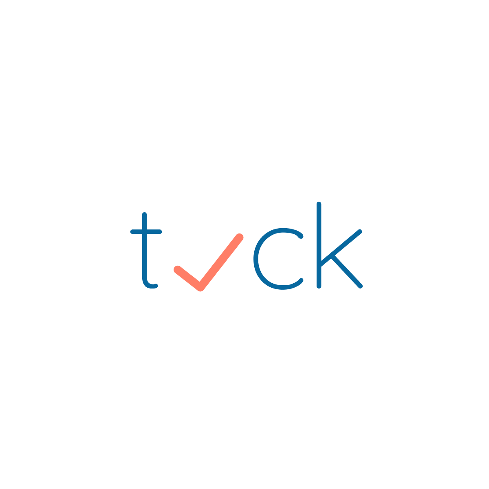

# tick

[](https://expo.io/)

Tick: Task & Reminder


## Require

- [NodeJS](https://nodejs.org/en/)
- [Expo](https://expo.io/)
- [Yarn](https://yarnpkg.com/lang/en/) (Optional)

## Quick start

```shell
$ yarn
$ yarn start
```
## Design

### Color

<a href="https://colorhunt.co/palette/66990">
  
</a>

```
07689f
a2d5f2
fafafa
ff7e67
```

### Font

[Dosis](https://fonts.google.com/specimen/Dosis)

### Logo



Build with 🙌 and ❤️
